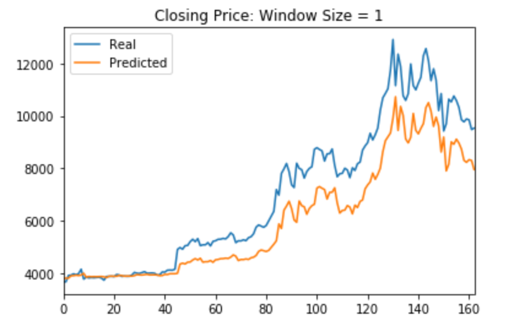
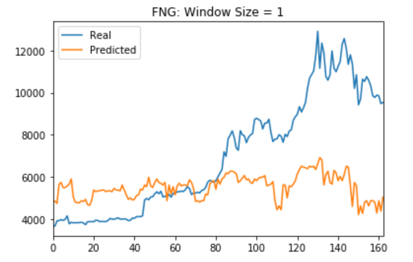
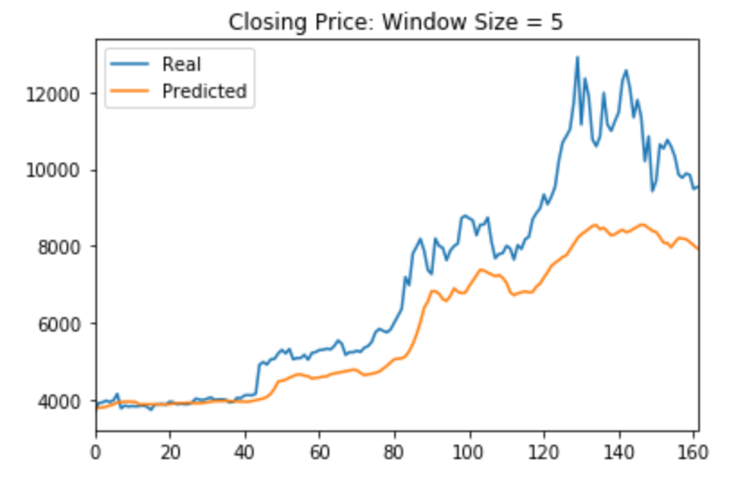
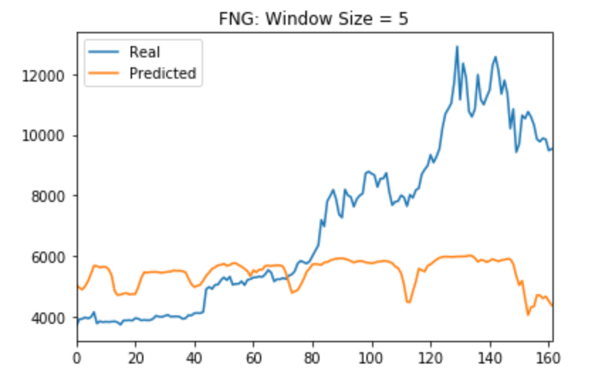
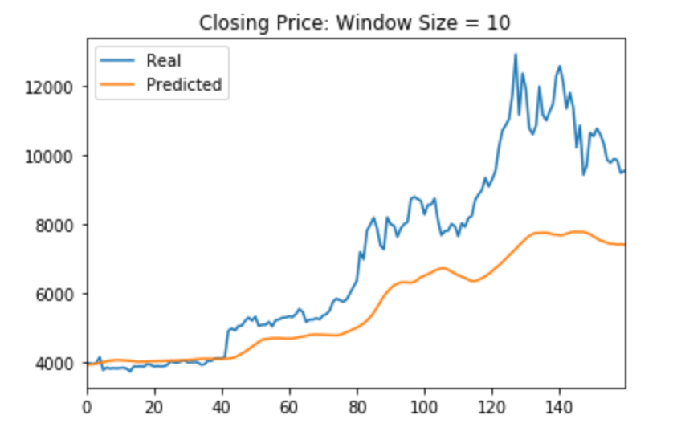
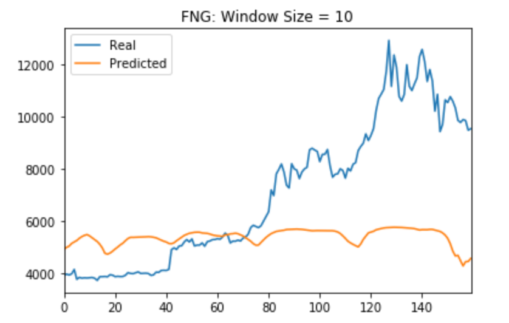

# LSTM Stock Predictor

We will be using deep learning recurrent neural networks to model bitcoin closing prices. One model will use the FNG indicators, the [Crypto Fear and Greed Index (FNG)](https://alternative.me/crypto/fear-and-greed-index/), which attempts to use a variety of data sources to produce a daily FNG value for cryptocurrency to predict the closing price; while the second model will use a window of closing prices to predict the nth closing price.

* For the Fear and Greed model, we are using the FNG values to try and predict the closing price.

* For the closing price model, you will use previous closing prices to try and predict the next closing price.

## Parameters

* Each model will need to use 70% of the data for training and 30% of the data for testing.

* Will be applying a MinMaxScaler to the X and y values to scale the data for the model.

* Will be reshaping the X_train and X_test values to fit the model's requirement of (samples, time steps, features).

* Using at least 10 estimators for both models.

## Conclusion

#### *Closing vs. Fear and Greed Model*

Tested models with window sizes of: 1, 5, and 10.

| Closing                         | FNG                         |
|:---:                            | :---:                       |
|          |     |
|          |     |
|          |     |

The closing model has a lower loss and tracks closer to the actual values better over time. However, the models predicted better with a window size of 1 and weakened as the lag increased.

